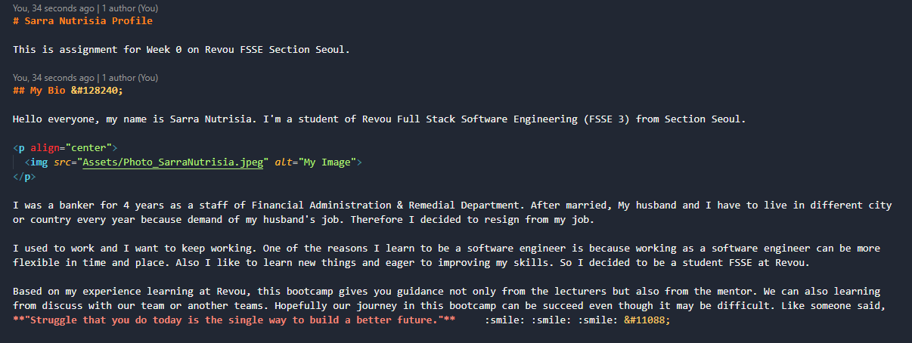

# Sarra Nutrisia Profile

This is assignment for Week 0 on Revou FSSE Section Seoul.

## My Bio &#128240;

Hello everyone, my name is Sarra Nutrisia. I'm a student of Revou Full Stack Software Engineering (FSSE 3) from Section Seoul.

I was a banker for 4 years as a staff of Financial Administration & Remedial Department. After married, My husband and I have to live in different city or country every year because demand of my husband's job. Therefore I decided to resign from my job.

I used to work and I want to keep working. One of the reasons I learn to be a software engineer is because working as a software engineer can be more  flexible in time and place. Also I like to learn new things and eager to improving my skills. So I decided to be a student FSSE at Revou.

Based on my experience learning at Revou, this bootcamp gives you guidance not only from the lecturers but also from the mentor. We can also learning from discuss with our team or another teams. Hopefully our journey in this bootcamp can be succeed even though it may be difficult. Like someone said, **"Struggle that you do today is the single way to build a better future."**     :smile: :smile: :smile: &#11088;

## My Links &#128279;

* _[GitHub Sarra](https://github.com/SarraNutrisia)_ 
  

* _[Instagram Sarra](https://instagram.com/SarraNutrisia)_  

* _[Linkedin Sarra](https://linkedin.com/in/sarra-nutrisia-9b64bbb6)_  
  

  
## What I've Learnt This Week &#9997;

**1. Code Editor & VS Code**
     Code editors are tools used by programmers and web developers to write and edit code. Visual Studio Code, also commonly referred to as VS Code, is a source-code editor made by Microsoft with the Electron Framework, for Windows, Linux and macOS. Features include support for debugging, syntax highlighting, intelligent code completion, snippets, code refactoring, and embedded Git.

**2. Markdown**
     Markdown is an easy-to-use markup language that is used with plain text to add formatting elements (headings, bulleted lists, URLs) to plain text. Markdown is used to documentation and spesification a project.

**3. Terminal & CLI**
     The terminal is a program that opens a graphical window and lets you interact with the shell. Most often the user interacts with the shell using a command-line interface (CLI). 

**4. Git**
     Git is a free and open source distributed version control system designed to handle everything from small to very large projects with speed and efficiency.

**5. GitHub**
     GitHub is an online software development platform. It's used for storing, tracking, and collaborating on software projects. It makes it easy for developers to share code files and collaborate with fellow developers on open-source projects.

## My Favorite Websites &#128241;

Website                                     |                     URL                     |                   Reason                    |
---------- |---------------------------------------------|---------------------------------------------|
      | [Link Google](https://www.google.com/)      | To gain information                         |
    | [Link Youtube](https://www.youtube.com/)    | To entertain, search and learning something |
| [Link Instagram](https://www.instagram.com/)| To gain information and socialize           |
  | [Link Chat GPT](https://chat.openai.com/)   | To gain information and search for solution |

## My Code Example &#128187;

### Markdown

#### Theme by Sarra Nutrisia &#127776;
If you have any other questions that aren't covered in the documentation, feel free to e-mail &#128233; <sarra.nutrisia@gmail.com>.

