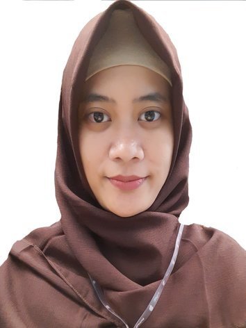

# Sarra Nutrisia Profile

This is assignment for week 0 on Revou FSSE Section Seoul.

## My Bio

Hello everyone, my name is Sarra Nutrisia. I'm a student of Revou Full Stack Software Engineering (FSSE 3) from Section Seoul.

I was a banker for 4 years as a staff of Financial Administration & Remedial Department. After married, My husband and I have to live in different city or country every year because demand of my husband's job. Therefore I decided to resign from my job.

I used to work and I want to keep working. One of the reasons I learn to be a software engineer is because working as a software engineer can be more  flexible in time and place. Also I like to learn new things and eager to improving my skills. So I decided to be a student FSSE at Revou.

Based on my experience learning at Revou, this bootcamp gives you guidance not only from the lecturers but also from the mentor. We can also learning from discuss with our team or another teams. Hopefully our journey in this bootcamp can be succeed even though it may be difficult. Like someone said, **"Struggle that you do today is the single way to build a better future."**     :smile: :smile: :smile:

## My Links

* GitHub : https://github.com/SarraNutrisia
* Instagram : https://instagram.com/SarraNutrisia
* 

